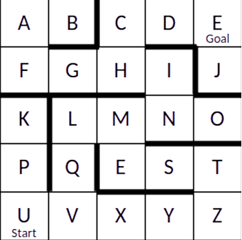

# Comparação de Desempenho entre Algoritmos de Busca em Largura (BFS) e Busca em Profundidade (DFS)

# Introdução
Na Inteligência Artificial, algortimos de busca são utilizados como métodos para encontrar resultados que sejam relevantes por meio da avaliação de dados. Isso acontece devido à característica desses algoritmos de percorrer e explorar o conjunto de dados, visando encontrar uma solução. 
Problemas que envolvem encontrar caminho, por exemplo, podem ser modelados através de um grafo e, então, ao aplicar um algoritmo de busca, uma análise de possíveis caminhos é feita percorrendo os nós do grafo. Dessa maneira, caso haja um caminho possível, este é retornado como solução para o problema. 

# Objetivo 
Implementar e comparar dois diferentes algoritmos de busca não informada aplicados a um problema clássico de busca - o problema do labirinto. 

  
   
  <em>Figura 1: Disposição do labirinto</em>

Observa-se pela disposição do labirinto que o melhor/menor caminho a ser encontrado, partindo de 'U' e alcançando 'E', é: 

U V Q L M N I H C D E

#  Implementação
A implementação foi realizada em C++. Para modelar o labirinto do problema, cada posição do tabuleiro foi atribuída como um nó de um grafo não direcionado. Cada vértice (nó) conecta com o outro se houver caminho possível. Ou seja, arestas são atribuídas caso não haja bloqueio de caminho, como mostra a [Figura 1](#labirinto).
O grafo, a pilha e a fila foram implementados manualmente, sem utilizar bibliotecas externas. O foco é na comparação de desempenho entre os dois algoritmos de busca: BFS e DFS.

## Descrição dos Algoritmos Implementados
- **BFS (Busca em Largura)**: Explora todos os vizinhos de um nó antes de avançar para o próximo nível de nós, gerenciando elementos com uma fila.
- **DFS (Busca em Profundidade)**: Explora o mais fundo possível em cada ramo antes de retroceder gerenciando elementos com uma pilha.

#  Medições de Desempenho
## Tempo de Execução
- Quanto tempo cada algoritmo leva para encontrar a solução.
- Para calcular o tempo de execução utilizou-se a biblioteca chrono. Dessa forma, foi possível mensurar a grandeza de tempo. Além disso, foi calculado o número de iterações que cada algoritmo executa. Não é uma grandeza de tempo, mas ao analisar quantos ciclos de iteração foram executados, torna possível identificar qual "trabalha" mais ao realizar a busca, do ponto inicial até a meta.

## Consumo de Memória
- A quantidade de memória utilizada durante a execução dos algoritmos.
- Para calcular o consumo de memória foi adicionado na estrutura que define o nó da fila/pilha uma variável que conta o maior número de elementos presentes na estrutura. Assim, é possível analisar o maior "tamanho" que cada estrutura ocupou em memória.

## Completude
- Verificar se o algoritmo sempre encontra uma solução (quando existir).

## Optimalidade
- Determinar se a solução encontrada é a melhor possível (menor caminho, por exemplo).

#  Análise dos Resultados
## Testes para Análise de Desempenho

#### Teste 1:
- **BFS**
  - Caminho encontrado em 23 iterações
  - Maior tamanho da fila: 3 nós
  - Memória utilizada pela fila: 48 bytes
  - Caminho encontrado: U V Q L M N I H C D E
  - Tempo de execução: 21 microsegundos

- **DFS**
  - Caminho encontrado em 13 iterações
  - Maior tamanho da pilha: 5 nós
  - Memória utilizada pela pilha: 80 bytes
  - Caminho encontrado: U V Q L M N I H C D E
  - Tempo de execução: 15 microsegundos

#### Teste 2:
- **BFS**
  - Caminho encontrado em 23 iterações
  - Maior tamanho da fila: 3 nós
  - Memória utilizada pela fila: 48 bytes
  - Caminho encontrado: U V Q L M N I H C D E
  - Tempo de execução: 9 microsegundos

- **DFS**
  - Caminho encontrado em 13 iterações
  - Maior tamanho da pilha: 5 nós
  - Memória utilizada pela pilha: 80 bytes
  - Caminho encontrado: U V Q L M N I H C D E
  - Tempo de execução: 4 microsegundos

#### Teste 3:
- **BFS**
  - Caminho encontrado em 23 iterações
  - Maior tamanho da fila: 3 nós
  - Memória utilizada pela fila: 48 bytes
  - Caminho encontrado: U V Q L M N I H C D E
  - Tempo de execução: 16 microsegundos

- **DFS**
  - Caminho encontrado em 13 iterações
  - Maior tamanho da pilha: 5 nós
  - Memória utilizada pela pilha: 80 bytes
  - Caminho encontrado: U V Q L M N I H C D E
  - Tempo de execução: 4 microsegundos

#### Teste 4:
- **BFS**
  - Caminho encontrado em 23 iterações
  - Maior tamanho da fila: 3 nós
  - Memória utilizada pela fila: 48 bytes
  - Caminho encontrado: U V Q L M N I H C D E
  - Tempo de execução: 25 microsegundos

- **DFS**
  - Caminho encontrado em 13 iterações
  - Maior tamanho da pilha: 5 nós
  - Memória utilizada pela pilha: 80 bytes
  - Caminho encontrado: U V Q L M N I H C D E
  - Tempo de execução: 14 microsegundos

#### Teste 5:
- **BFS**
  - Caminho encontrado em 23 iterações
  - Maior tamanho da fila: 3 nós
  - Memória utilizada pela fila: 48 bytes
  - Caminho encontrado: U V Q L M N I H C D E
  - Tempo de execução: 8 microsegundos

- **DFS**
  - Caminho encontrado em 13 iterações
  - Maior tamanho da pilha: 5 nós
  - Memória utilizada pela pilha: 80 bytes
  - Caminho encontrado: U V Q L M N I H C D E
  - Tempo de execução: 4 microsegundos

## Observações Encontradas
- **Optimalidade**: O caminho encontrado é o melhor/menor caminho, de fato, do labirinto para ambos os algoritmos.
- **Tempo de Execução**: O tempo de execução do DFS foi menor que o tempo de execução do BFS em média. Tanto em tempo, quanto em número de iterações.
- **Consumo de Memória**: A pilha do DFS ocupou mais memória do que a fila do BFS pois armazenou mais nós durante a execução.
- **Completude**: Ambos os algoritmos sempre encontraram solução para a disposição do tabuleiro apresentado.

## Resultados das Medições de Desempenho
- **BFS**:
  - Tempo de execução variou entre 8 e 25 microsegundos.
  - Memória utilizada variou entre 48 bytes.
  - Número de iterações: 23.
- **DFS**:
  - Tempo de execução variou entre 4 e 15 microsegundos.
  - Memória utilizada variou entre 80 bytes.
  - Número de iterações: 13.

## Análise Comparativa dos Algoritmos
- **Tempo de Execução**: DFS foi consistentemente mais rápido que BFS.
- **Consumo de Memória**: BFS utilizou menos memória que DFS.
- **Completude**: Ambos os algoritmos são completos.
- **Optimalidade**: Ambos os algoritmos encontraram o menor caminho.

# Conclusão 
Portanto, a partir da modelagem do labirinto em um grafo, aplicou-se os algoritmos de busca em largura (BFS) e busca em profundidade(DFS). Analisando os resultados foi possível identificar que o DFS apresentou melhor desempenho em termos de tempo de execução, enquanto BFS foi mais eficiente em termos de consumo de memória. Dessa forma, embora o labirinto utilizado como testes seja relativamente pequeno, observou-se características importantes ao comparar os algoritmos. 

---

# Compilação e Execução

O projeto possui um arquivo Makefile que realiza todo o procedimento de compilação e execução. Para tanto, temos as seguintes diretrizes de execução:

| Comando                |  Função                                                                                           |                     
| -----------------------| ------------------------------------------------------------------------------------------------- |
|  `make clean`          | Apaga a última compilação realizada contida na pasta build                                        |
|  `make`                | Executa a compilação do programa utilizando o gcc, e o resultado vai para a pasta build           |
|  `make run`            | Executa o programa da pasta build após a realização da compilação                                 |

---

# Autores
- **Anielly Gonçalves**: anielly@aluno.cefetmg.br
- **Emanuel Vieira Tavares**:emanuel@aluno.cefetmg.br 

  DECOM-DV/CEFET-MG.
  2024/2.
